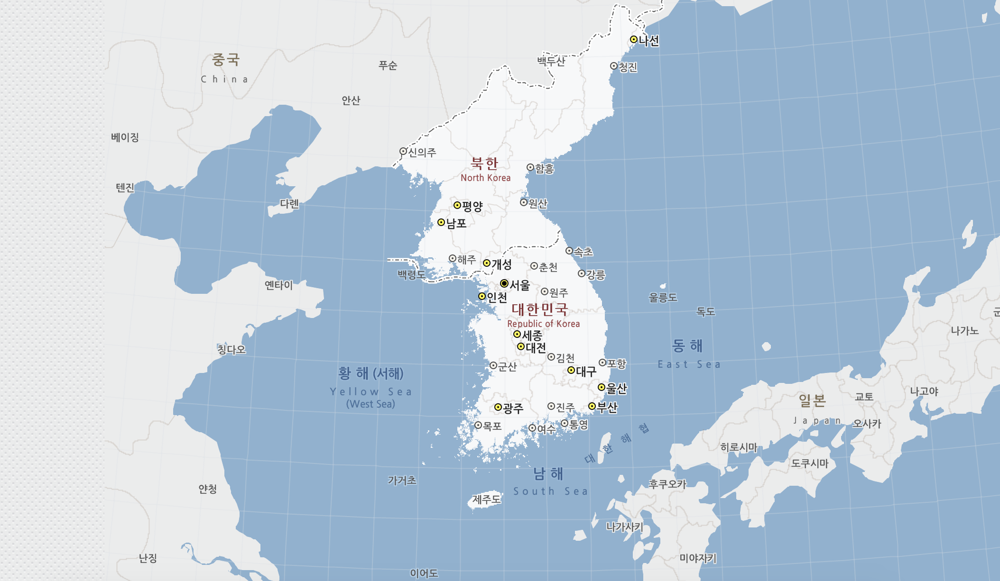
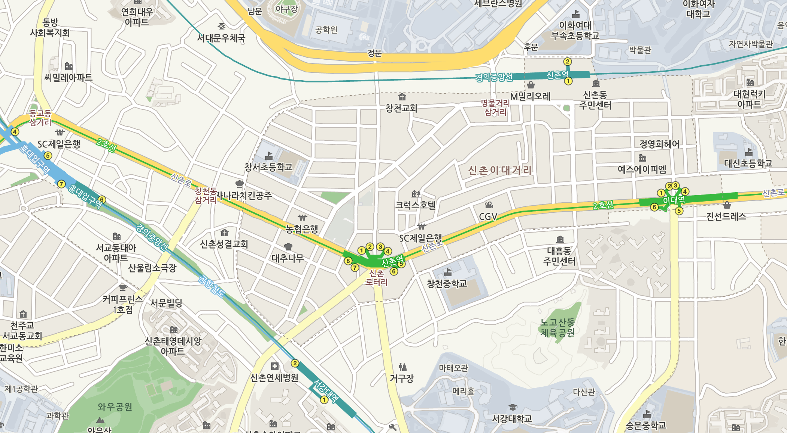

#  THTiledImageView

[](https://travis-ci.org/TileImageTeamiOS/THTiledImageView)
[](https://codecov.io/gh/TileImageTeamiOS/THTiledImageView)
[](https://github.com/TileImageTeamiOS/THTiledImageView)
[](https://github.com/TileImageTeamiOS/THTiledImageView)
[](https://github.com/TileImageTeamiOS/THTiledImageView)
[](https://developer.apple.com/swift/)


## Feature

- [x] 🖼 `THTiledImageView` fully support `UIScrollView`. You can subclass it and use it.
- [x] 📡 Support Async Image Downloading & Caching.
- [x] 🔍 You can set different tiled images based on user's zoom scale.
- [x] 🔪 Support Image Cutting Extension Method to generate tiled images.

## Demo


## Installation

### CocoaPods

You can install the latest release version of CocoaPods with the following command

```bash
$ gem install cocoapods
```

Simply add the following line to your Podfile:

```ruby
pod "Kingfisher"
pod "THTiledImageView"
```

Then, run the following command:

```bash
$ pod install
```

## Requirements

`THTiledImageView` is written in Swift 4, and compatible with iOS 9.0+. We use [Kingfisher](https://github.com/onevcat/Kingfisher) library for image downloading and caching. So you need to install `Kingfisher` also to use `THTiledImageView`.

## How to use

1. `THTiledImageScrollView` is subclass of UIScrollVIew. Create `THTiledImageScrollView` from Storyboard or programmatically.

```Swift
class ViewController: UIViewController {
    @IBOutlet weak var tileImageScrollView: THTiledImageScrollView!
}
```

2. Create dataSource class that conforms `THTiledImageViewDataSource`.

```Swift
class ViewController: UIViewController {
    @IBOutlet weak var tileImageScrollView: THTiledImageScrollView!

    var dataSource: THTiledImageViewDataSource?
}
```

3. Here is `THTiledImageViewDataSource` options that you can use.

```Swift
func setupExample(tileImageBaseURL: URL, imageSize: CGSize, tileSize: [CGSize], thumbnail: URL) {

    dataSource = MyTileImageViewDataSource(tileImageBaseURL: tileImageBaseURL, imageSize: imageSize, tileSize: tileSize)

    guard let dataSource = dataSource else { return }

    dataSource.thumbnailImageName = "bench"

    // User can see this level of tiles when they zoom in the image
    dataSource.maxTileLevel = 3

    // User can see this level of tiles when they zoom out the image
    dataSource.minTileLevel = 1

    // Allowable maximum level of scrollView zoom
    dataSource.maxZoomLevel = 8

    dataSource.imageExtension = "jpg"

    // Local Image For Background
    dataSource.setBackgroundImage(url: thumbnail)

    // Remote Image For Background
    dataSource.backgroundImageURL = URL(string: "Image URL goes here")
    dataSource.requestBackgroundImage { _ in }

    // size of scrollView Frame
    dataSource.scrollViewSize = setScrollViewSize()

    tileImageScrollView.set(dataSource: dataSource)
}
```

### Async Image Downloading & Caching

From Version 0.3.0, We support setting tile image from remote server.

- Set the base URL that you want to download image, and set the `accessFromServer` option to `true`.

```Swift
dataSource.tileImageBaseURL = URL(string: "http://127.0.0.1:5000")
dataSource.accessFromServer = true
```

- Put tiled images on your Server. Take a look at our [image path rules](https://github.com/TileImageTeamiOS/THTiledImageView/tree/update-readme#tiled-images-path) to use downloading.

### Zoom and Tile Level

`THTiledImageView`'s zoom level and tile level can be set separately.

#### Zoom Level

UIScrollView's Zoom level. Default `minimum zoom level` is scale aspect fit size of scrollView. `maximum zoom level` is allowable zoom in level.

#### Tile Level

Tiled images can be shown at specific zoom level based on tile level. For example, if you set `(minTileLevel, maxTileLevel) = (1, 5)`, You can set 5 different images by tile level.

Tile level 1 can be used wide range of image.



Tile level 5(or more than 1) can be used narrow range of image.




### Cutting Image

> ❗️ Cutting and rendering images cannot be done simultaneously. You should cut images first(from another viewController), and render the image.

We offer you image cutting function(`UIImage.saveTileOf(size:name:withExtension:)`. Specify the size of tiles by levels.

```Swift
// size and level will be 512-1, 256-2, 128-3(size-level).
let tiles: [CGSize] = [CGSize(width: 512, height: 512),
                       CGSize(width: 256, height: 256), CGSize(width: 128, height: 128)]

// static function
UIImage.saveTileOf(size: tiles, name: "bench", withExtension: "jpg")
```

#### Tiled Images path

Tiled images will be saved on your cache directory. Path of the cache directory:

```Swift
let cachesPath = NSSearchPathForDirectoriesInDomains(.cachesDirectory, .userDomainMask, true)[0] as String
```

If imagefile saved successfully, you can see images from cache directory. Here is the rule of directory path and image file name rules.

```
Path Rules ./imageName/imageSize/{imageName_imageSize_level_x_y}.jpg
Example    ./bench/256/bench_256_1_0_0.jpg
```

> ❗️ If you create images on your own, you need to obey the path rules to use `THTileImageView`.

#### Tiled Images path For Server

1. Put tiles on your server. path of image should looks like this.

```
http://127.0.0.1:5000/bench/256/bench_256_1_0_0.jpg
```

All you need to do is go to the cache directory and take out and put that directory to your server.

### THTiledImageScrollViewDelegate

You can use `UIScrollViewDelegate` methods from `THTiledImageScrollViewDelegate`.

```Swift
public protocol THTiledImageScrollViewDelegate: class {
    func didScroll(scrollView: THTiledImageScrollView)
    func didZoom(scrollView: THTiledImageScrollView)
}
```

See our example for more details.

## License

`THTiledImageView` is released under the MIT license. [See LICENSE](https://github.com/TileImageTeamiOS/THTiledImageView/blob/master/LICENSE) for details.
